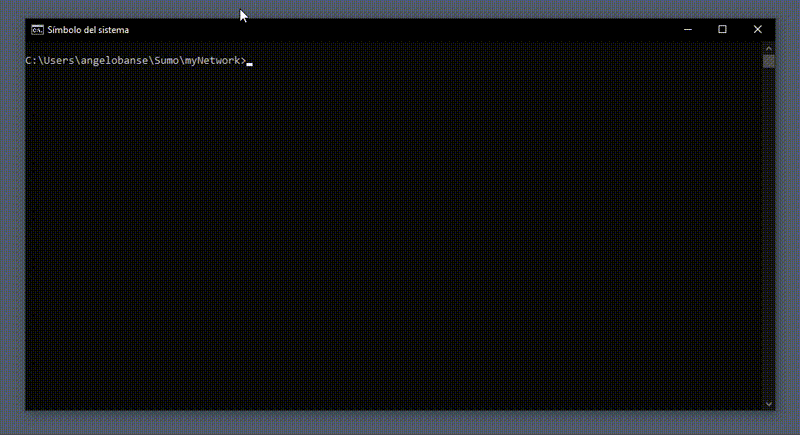
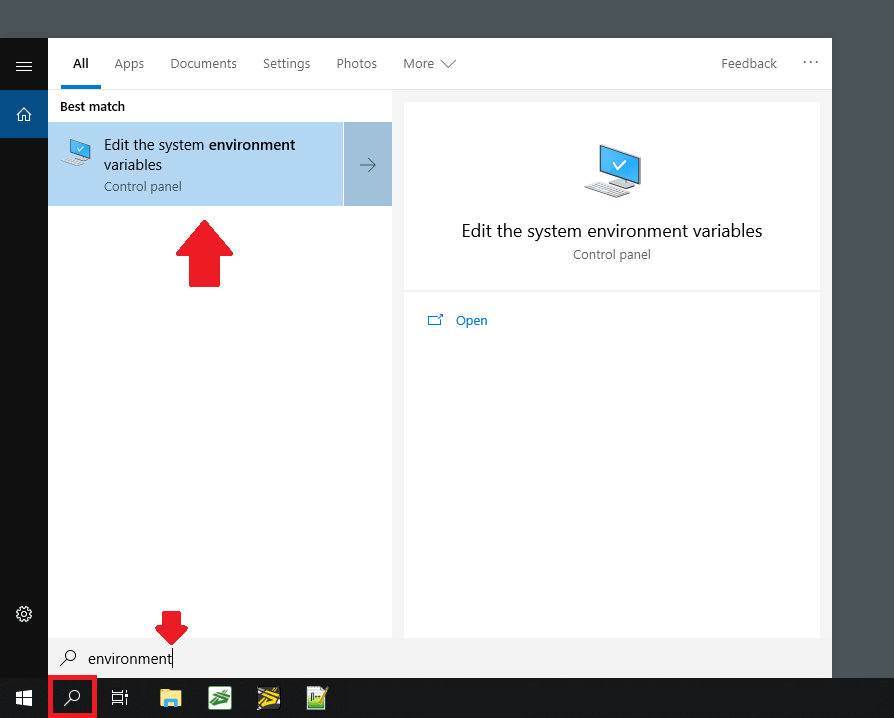
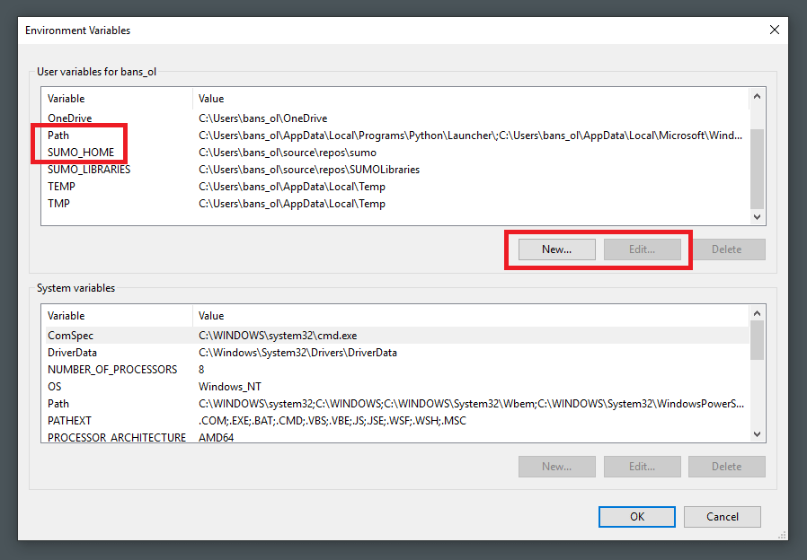

# Introduction

To work with SUMO a few basic computer skills are needed (since
Linux-users are probably familiar with these, all explanations refer to
MS-Windows):

# Using a [Text Editor](https://en.wikipedia.org/wiki/Text_editor)

SUMO requires configuration files and data files for proper execution.
These files can be created and edited with a text editor.

On Windows you can open a basic text editor in the following way:

```
Start->Windows Accessories->Notepad
```
Or by pressing the `Win` + `R` keys and entering `notepad`

Notepad is a very basic text editor. You can increase your comfort and
productivity by switching to an editor with more features. Consider
[Notepad++](http://notepad-plus-plus.org/) or
[vim](http://www.vim.org/download.php#pc) and also see this [comparison of text editors](https://en.wikipedia.org/wiki/Comparison_of_text_editors)

!!! note
    Files used by SUMO have by convention names ending with
    `.xml` and variants of `.sumocfg` (those are called file extensions). Doing a double-click in Windows
    Explorer will probably not open up your favorite text editor. Either
    open the file from within your text editor or
    [learn](https://www.google.com/#q=windows+file+associations) how to
    change file associations.

# Working with Files and Folders

To work with the various files needed by SUMO you must be able to find
them on your file system. For starters learn about using Windows
Explorer [here](https://www.teacherclick.com/winxp/t_4_1.htm) or
[here](https://www.google.com/#q=windows+explorer+tutorial).

# Running Programs from the Command Line

SUMO consists of many separate programs for different simulation-related
tasks (a reference to all the seperate programs can be found
[here](../SUMO_at_a_Glance.md#included_applications) and a list of the additional Tools [here](../index.md#additional_tools)).
Only [sumo-gui](../sumo-gui.md) (*sumo-gui.exe*) and [netedit](../netedit.md) (*netedit.exe*) have a
graphical user interface (GUI). All other programs must be called from
the **command line**.

At first you have to open the command line. On Windows, you have to
start "**cmd.exe**" (Start-\>Windows System-\>Command prompt). You can also press the `Win` + `R` keys and enter `cmd` or search for `cmd` in the Windows search box, on the Taskbar.

A black window should
appear. This is your command line. Since version 0.12.3 you can also
double-click the file **start-command-line.bat** (see also
[below](#sumo_0123_and_later)) to open a command line with
useful environment variables set (it can be found in the same folder as
all other sumo executables). When using Linux, you have to start a
terminal (like **xterm**).

The command line lets you start programs by typing the program's name
followed by program options. Since this can be automated it is
potentially more comfortable for repetitive tasks than using a GUI.
Commands look like this

```
netconvert --node-files=hello.nod.xml --edge-files=hello.edg.xml --output-file=hello.net.xml
```
Here *netconvert* is the name of the program and the rest of the command
sets options for this program.

A command line execution (in this case a very basic *sumo* simulation) is shown in the following gif:



The sections below should be sufficient to get you started using SUMO.
For further information about the command line see [Basics/Using the
Command Line
Applications](../Basics/Using_the_Command_Line_Applications.md).
Also look [here](https://ss64.com/nt/).

## SUMO 0.12.3 and later

In your SUMO release (all SUMO files and folders you downloaded) there
is a `bin` directory. This directory contains a batch file named
`start-command-line.bat`. This batch file starts a command-line and
makes sure that you can execute SUMO-programs.

1.  execute *start-command-line.bat* by double-clicking
2.  navigate to the directory containing your configuration and network
    files using the command [cd](https://ss64.com/nt/cd.html) (change
    directory)
3.  enter a command such as

```
netconvert --node-files=hello.nod.xml --edge-files=hello.edg.xml --output-file=hello.net.xml
```

and press `enter`

## SUMO_HOME

Many [tools](../Tools.md) require the environment variable
`SUMO_HOME` to be set to the base directory of the sumo installation.
This is the directory containing the folders *bin* and *tools*. Setting
environment variables is explained below.

!!! note
    This variable is also used to find [xsd schema files for input validation](../XMLValidation.md). If the variable is not set, schema files are downloaded from the internet and this may file if the server [sumo.dlr.de](https://sumo.dlr.de/) is not reachable.

## Configuring Path Settings

To run programs from the command line comfortably you must configure
your `PATH` variable and the `SUMO_HOME` variable.

### Windows

!!! note
    If you have installed SUMO via the windows *.msi* installer file, this is done automatically.

1.  On the Windows search box (on the Taskbar) search for *environment*. The best match result should be the "Edit the system environment variables" option. Open it.   

2.  A small window should appear. Under *user variables* select **PATH** (or **Path** - Windows environment variables are case insensitive) and click *Edit*. If no such variable exists you must create it with the *New*-Button   

3.  Append `;C:\Program Files\sumo-{{Version}}\bin` to the end of the **PATH** value
    (don't delete the existing values\!)
4.  Under *user variables* now select **SUMO_HOME** and click *Edit*. If no such
    variable exists you must create it with the *New*-Button
5.  Set `C:\Program Files\sumo-{{Version}}` as the value of the **SUMO_HOME** variable

!!! note
    Replace `C:\Program Files\sumo-{{Version}}\` with your sumo directory.

!!! caution
    You must close and reopen any existing command-line window for the new variable setting to become effective.


### Linux

#### Temporary Solution

To set an environment variable temporarily, you can use the following
command in your terminal:

```
export SUMO_HOME="/your/path/to/sumo/"
```

This sets the environment variable to be used by any program or script
you start in your current shell session. This does not affect any other
shell session and only works until you end the session.

!!! note
    Replace `/your/path/to/sumo/` with your sumo directory.

#### Permanent Solution

To set an environment variable permanently, follow these steps:

1.  Open a file explorer of your choice and go to `/home/YOUR_NAME/`.
2.  Open the file named `.bashrc` with a text editor of your choice.
    (You may have to enable showing hidden files in your file explorer)
3.  Place this code `export SUMO_HOME="/your/path/to/sumo/"` somewhere
    in the file and save. (Don't delete any existing content\!)
4.  Reboot your computer. (Alternatively, log out of your account and
    log in again.)

The environment variable will now be used by any program you start from
the command line with your current user account.

!!! note
    Replace `YOUR_NAME` with your username; Replace `/your/path/to/sumo/` with your sumo directory.

#### Using a pre-packaged version of SUMO

When using the sumo version that comes with your package manager (i.e.
apt) the SUMO_HOME variable must be set to the base path of the tools
folder. On Ubuntu this is

```
/usr/share/sumo
```

### macOS

First you need to determine which shell (**bash** or **zsh**) you are currently working with. In a terminal, type `ps -p $$`  (this should let you see under CMD which shell you are using). The default shell in macOS Catalina is **zsh**.

#### for ZSH

In a Terminal, execute the following steps:
```
open ~/.zshrc
```
This will open the *.zshrc* file in TextEdit. Add the following line to that document:
```
export SUMO_HOME="/your/path/to/sumo"
```
Make sure to replace `/your/path/to/sumo` with your ***actual*** path to sumo.   
Save that document in TextEdit. Now you need to apply the changes by entering:
```
source ~/.zshrc
```
in the terminal. You are done! To test if the environment variable was set correctly, you can print it into the terminal:
```
echo $SUMO_HOME
```
and you should be able to get the recently added path there.

#### for Bash

In a Terminal, execute the following steps:
```
open ~/.bash_profile
```
This will open the *.bash_profile* file in TextEdit. Add the following line to that document:
```
export SUMO_HOME="/your/path/to/sumo"
```
Make sure to replace `/your/path/to/sumo` with your ***actual*** path to sumo.   
Save that document in TextEdit. Now you need to apply the changes by entering:
```
source ~/.bash_profile
```
in the terminal. You are done! To test if the environment variable was set correctly, you can print it into the terminal:
```
echo $SUMO_HOME
```
and you should be able to get the recently added path there.

# Tips for using the Command-Line

## Copy and Paste

The standard hotkeys for copy and paste do not work in the command-line.
You can access an edit menu for copy/paste by right-clicking the
command-line window. For increased convenience you can also right-click
the title-bar of the command-line window and select properties. Then
check the box **quick-edit** under the options-tab. You can now select
text with the left mouse button and copy it using right-click. Another
right-click is used to paste the copied text.

## Repeating previous commands

Hitting the *up*- and *down*-arrow buttons allows you to move through
the history of previously entered commands. You can edit these commands
or simply hit *enter* to execute them again.