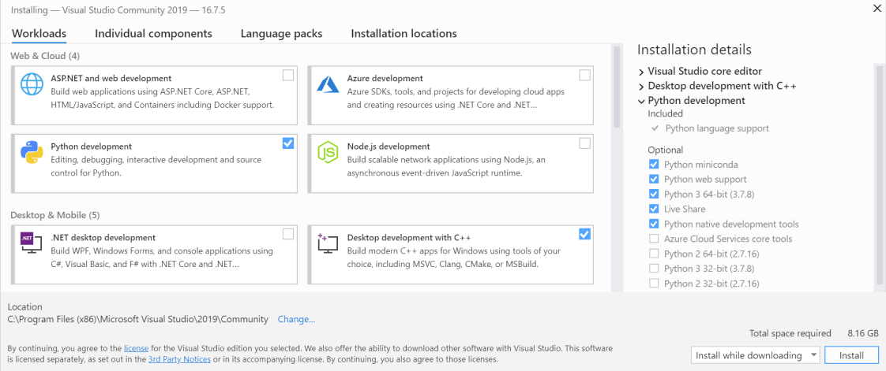
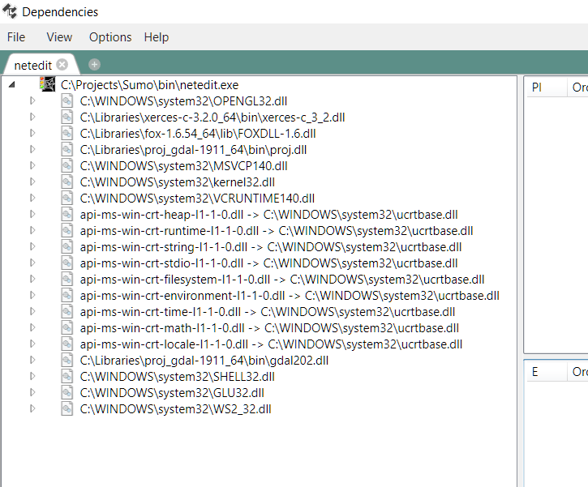
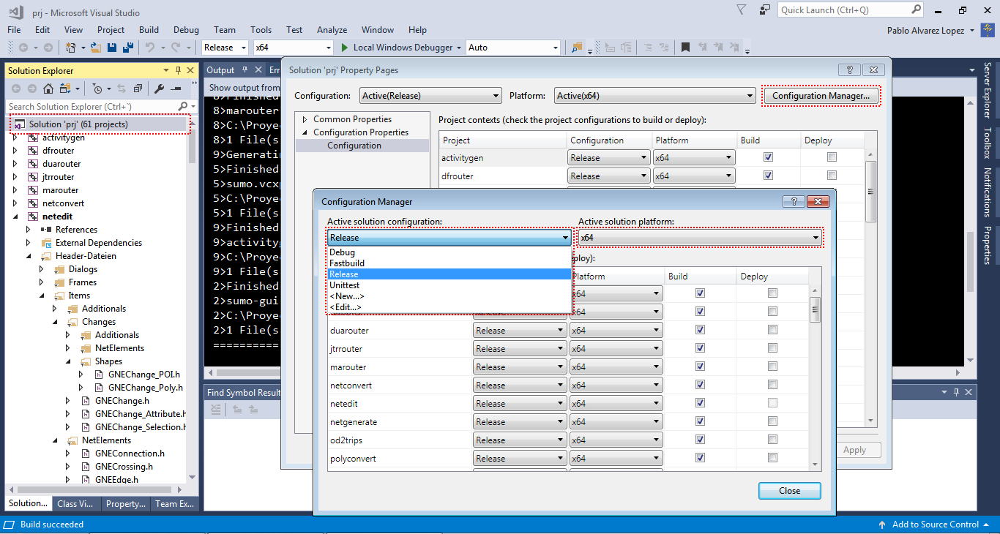

This document describes how to build SUMO under MS-Windows using only
freely available (this does **not** mean "open source") tools.
Instructions on how to build SUMO on Windows using an Open Source
toolchain are included in our [building on
Linux](../Installing/Linux_Build.md) pages. Please note that you
may also [download pre-build Windows binaries](../Downloads.md).

## Recommended Windows setup

- Download [Visual C++ Community Edition](https://www.visualstudio.com/vs/community/)
  - Start the installer and select:
    - Python Development (including native tools)
    - C++ for desktop



- clone https://github.com/eclipse/sumo or open your existing local SUMO folder
- go to team explorer
  - choose Manage Connections, then "Local Git"->Clone https://github.com/DLR-TS/SUMOLibraries
- now be patient until CMake starts configuring
  - if it does not or you want to reconfigure choose Project->"Generate Cache" (if this option is not there you may need to wait a little longer until Visual Studio has picked up everything)
- Select Build->BuildAll (CMake->BuildAll in earlier versions)
- set SUMO_HOME
- Install Texttest https://sourceforge.net/projects/texttest/files/latest/download

### optional but still recommended steps

- Install notepad++
- Install TortoiseGit
- Install [Git command line tools](https://git-scm.com/download/win) (this is mandatory if you install TortoiseGit)
- If you decide to use the Python which comes with Visual Studio
  - Test start a python script and add association
  - Add Python to the path (also the Scripts dir), find it at C:\Program Files (x86)\Microsoft Visual Studio\Shared\Python37_64
  - Install pyautogui, matplotlib, rtree, pyproj, lxml following the instructions https://docs.microsoft.com/en-us/visualstudio/python/tutorial-working-with-python-in-visual-studio-step-05-installing-packages?view=vs-2019
- If not use `pip install pyautogui, matplotlib, pyproj, lxml`
- Download [rtree from here](https://www.lfd.uci.edu/~gohlke/pythonlibs/#rtree) and install it using pip or Visual Studio
- (after 30 days) Setup a Microsoft account (if you do not already have one) and register your Visual Studio

## Further notes

If you need a different python version or want to test with multiple pythons you can either install them directly from Visual Studio or [Download Python for Windows](http://www.python.org/download/) and install it. Most SUMO tools should work with Python 2 and 3. Please make sure that you install the recommend python modules as above.

If you want to clone / checkout a special sumo version, you can of course do it from the ommand line (if you have installed the command line tools)
using `git clone --recursive https://github.com/eclipse/sumo` or download and extract a source package, see [Downloads](../Downloads.md)

The command for the [\#Libraries](#libraries) is: `git clone --recursive https://github.com/DLR-TS/SUMOLibraries`. If you do not place the libraries in the same folder as sumo, you will need to set the SUMO_LIBRARIES environment variable to the directory.

It Visual Studio fails at first try (maybe SUMOLibraries are not cloned yet or are in an unusual location, the errors talk about not finding Xerces)
  - Select Project->"Generate Cache" to try again (it is CMake->Generate in earlier Visual Studio versions)
    - If it still fails, edit CMakeCache.txt from the CMake menu and set the path (e.g. SUMO_LIBRARIES:PATH=C:/Users/testus/source/repos/SUMOLibraries) and retry

## Libraries

We provide a central location for getting all dependent libraries at
<https://github.com/DLR-TS/SUMOLibraries>. The easiest way is to clone
this repository and define an environment variable `SUMO_LIBRARIES`
pointing to the resulting directory. They are build with Visual Studio
2017, but may be used with earlier and later versions as well. You may
need to install the Visual C++ 2017 Runtime Distributable for running
SUMO then (tested with Visual Studio 2013). 

!!! Caution
    When cloning SUMOLibraries you must initialized all submodules with `git submoudle update --init`

For details on building your
own and also on how to use different versions and additional libraries
see [Installing/Windows_Libraries](../Installing/Windows_Libraries.md).
Make sure that the subdirectories `fox-1.6.54/lib`, `proj_gdal-1911/bin`
and `xerces-c-3.2.0/bin` are in PATH. Note: for 32 bits compilations
folders are `32bits/fox-1.6.54/lib`, `32bits/proj_gdal-1911/bin` and
`32bits/xerces-c-3.2.0/bin`. You can add both to the path but always add the
64 bit version first.

## Tests

- If you plan to extend SUMO yourself, or just want to know whether
  everything compiled OK, it is strongly recommended to have a look at
  [Developer/Tests](../Developer/Tests.md). This tool makes it
  easier to check whether some existing functionality was broken by
  the extensions.

## Troubleshooting

- Note on installation paths: MSVC seems to have difficulties with
  include and library paths containing spaces (for instance
  `C:\Program Files`). Thus try to avoid installing SUMO or any of the
  libraries in such paths.

### Linker reports something similar to "LINK : fatal error LNK1104: cannot open file 'C:\\Program.obj'"

You probably have installed a library to a path containing white spaces
in its name. In such a case, the according environment variable should
be embedded in quotes (").

Example: set FOX="D:\\my libs\\fox-1.6.36".

### Failure on pre-build event (missing version.h or \*typemap.h)

If Visual Studio reports a failed pre-build event you can safely ignore
this, unless you are building from the [source code
repository](../FAQ.md#how_do_i_access_the_code_repository). In
this case you should probably install Python. Even if python is
installed the file associations may be broken which causes the
generation of src/version.h via tools/build/version.py to fail. Either
repair your file associations or undefine HAVE_VERSION_H in
src/windows_config.h.

If you did install Python correctly, double check that it passes
[command line
arguments](http://stackoverflow.com/questions/2640971/windows-is-not-passing-command-line-arguments-to-python-programs-executed-from-t).
For a quick fix, you can also execute the following commands manually:

```
tools\build\version.py
tools\build\typemap.py
```

### Execution cannot proceed because MSVCR120.dll/MSVCR140.dll was not found

Install Microsoft [Visual C++ Redistributable Packages for Visual
Studio 2012](https://www.microsoft.com/en-US/download/details.aspx?id=30679)
(for MSVCR120.dll) or [Microsoft Visual C++ Redistributable Packages for
Visual Studio 2015](https://www.visualstudio.com/downloads/) (for
MSVCR140.dll). You can check if all dependencies are correct using
[Dependencies](https://lucasg.github.io/Dependencies/)



### In debug mode, execution cannot proceed because MSVCR120D.dll/MSVCR140D.dll was not found

Your version of Visual Studio doesn't support Debugging, only can be
compiled in release mode.

## Available configurations

The release build is used for the distribution of sumo. The Debug build
allows all debugging features. Keep in mind that
[Texttest](../Developer/Tests.md) usually picks up the release
build.

- Release: All optimizations, assertions disabled, no debugging
  symbols, links against external release libs
- Debug: No optimizations, assertions enabled, debugging symbols
  included, links against external debug libs

Left clicking over Solution/Properties/Configuration Manager allow to
change between configurations:



To switch to a different platform (e.g. 32bit instead of 64 bit) please
run cmake again with a different generator.

Naming Conventions: 64bit executables have the same name as their 32bit
counterpart. The Debug build additionally carries the suffix 'D'.
