# Netedit common edit modes

## Inspect

Inspect and modify attributes of edges, lanes, junctions, connections and additional network items (i.e. bus stops). Modifications have to be confirmed by hitting <Enter\> (except for Boolean attributes). If the entered value is not appropriate for the modified attribute, the value will turn red to indicate the problem.

When inspecting an element that is [selected](#select) along with multiple elements of the same type this mode behaves differently:

- Only non-unique attributes are listed (i.e. lane-width but not lane-ID)
- If the elements differ in their attributes, the whole range of occurring values is shown
- All selected elements of the same type are modified at the same time when setting a new value

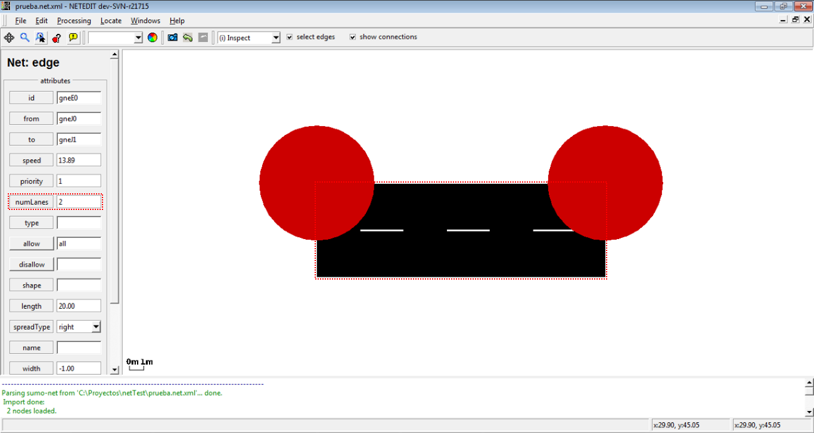Changing the number of lanes of an edge.
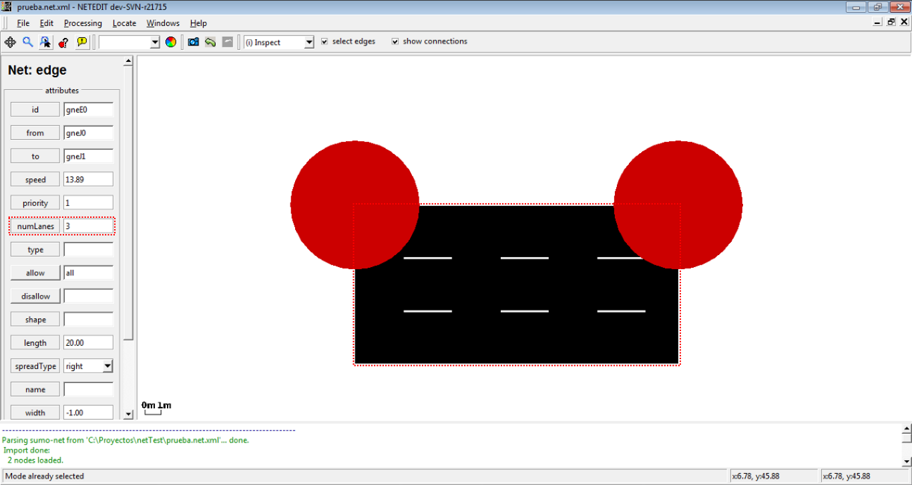Number of lanes of the edge changed

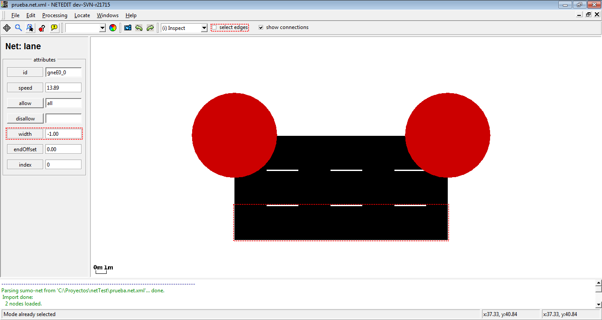Changing the width of a lane. Note that option "select edges" is disabled. 

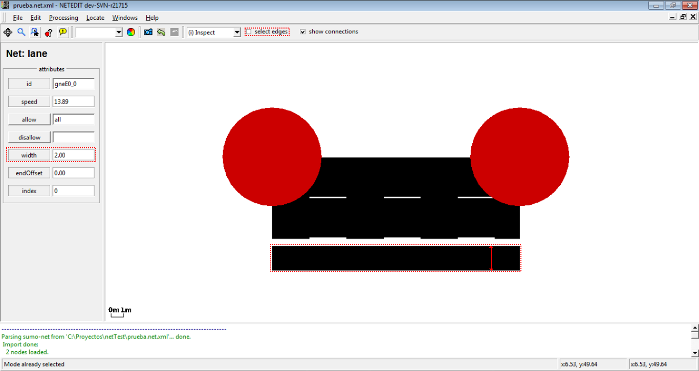Width of lane changed (gaps will disappear upon triggering recomputation with **F5**)

### Generic Parameters
Most simulation objects support [Generic Parameters](../Simulation/GenericParameters.md) to express custom user data and supplemental configurations. They can be edited with the 'Edit parameters' dialog which is accessible with the 'Edit parameters' button. 

In inspect mode, a serialized form of the parameters is also given. In this form, all parameters are concatenated using the '=' sign between key and value and by using the '|' sign between parameters. Serialization of key value pars that use these separating characters in their key or value is currently not supported by netedit (though permitted by SUMO). 
The serialized form is useful in select mode when selecting objects with a particular parameter.

### Edge template

When inspecting an edge, the extra buttons *set Edge ... as Template* and *Copy ... into edge ...* appear in the inspection frame. These can be used to set default attributes for [Create Edges](editModesNetwork.md#create_edges) and to copy attributes between edges.

The following (non-unique) attributes are set/copied:

- speed
- priority
- numLanes
- allow/disallow
- type
- spreadType
- width

When copying attributes from one edge to another, lane-specific attributes will be copied as well.

## Delete

The Delete mode is used to remove an element of your network. The following is possible:

- Delete junctions (and all adjoining edges)
- Delete edges
- Delete geometry points of an edge
- Delete a lane (when option *selection edges* is disabled)
- Delete connections (available, when *show connections* is enabled)
- Delete crossings
- Delete additionals

The delete frame own a list of elements that is filled automatically with the childs of the current element under the cursor. This list of child elements can be marked using Control + left-Click, and every child can be centered, inspected or removed individually with a right click over an element.

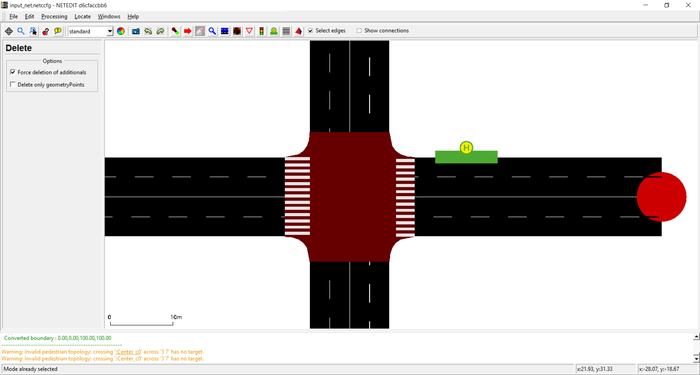General view of the delete frame

Additionally, the delete frame has a list of options to avoid undesirable deletes:

- Force deletion of additionals: Used to avoid undesirable deletion of additionals.

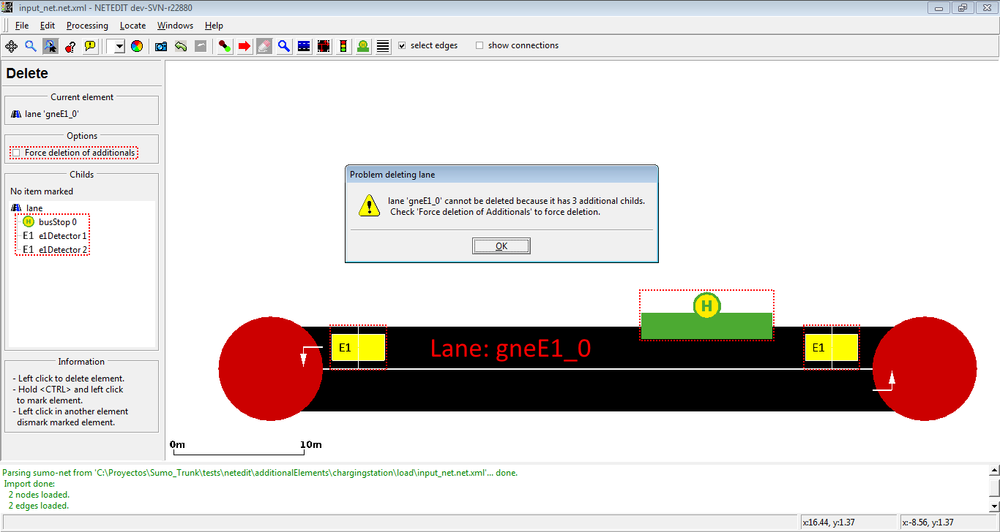If the user tries to remove an element with additional childs and 'Force deletion of additionals' is disabled, netedit shows a warning dialog and the element isn't deleted.

- Delete only geometry points: Used to remove only geometry points

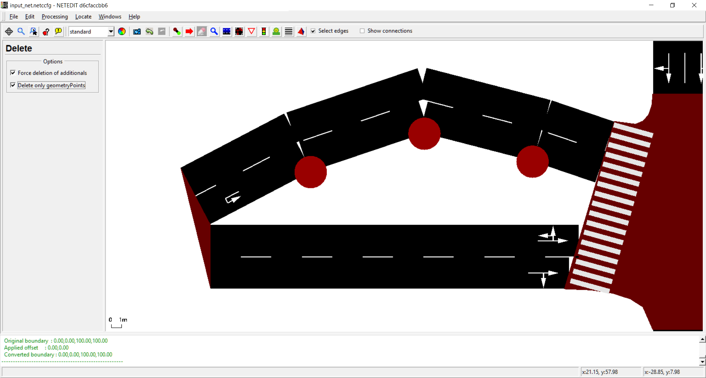Only Geometry points can be deleted

## Select

Select network objects according to various criteria. Selected objects can be moved or deleted together. It is also possible to set attributes for all selected junctions (or all edges) at the same time using **inspect mode**.

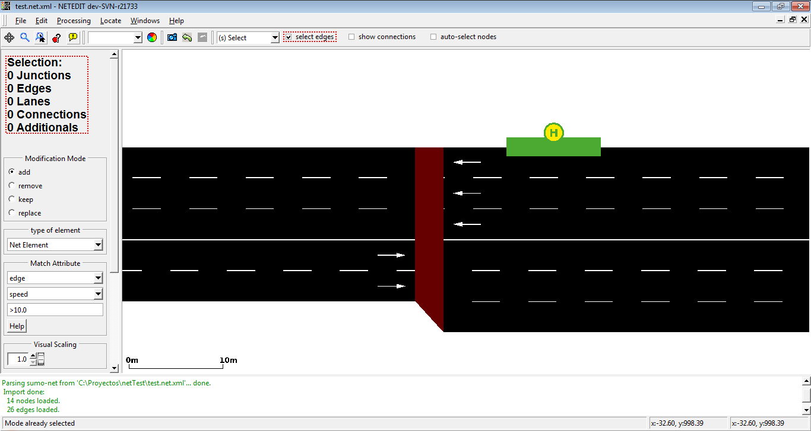The left frame shows information about the current selected elements. 

Selected elements are painted with a different color.

### Methods for selecting

- the selection status of objects is toggled by left-clicking. When the *select edges* check-box is unset, lanes, rather than edges will
  be selected/deselected.
- by rectangle-selection via shift+leftClick+drag (When the checkbox *auto-select junctions* is enabled, junctions of selected edges will be selected automatically)
- by matching object attributes [(see below)](#match_attribute)
- by loading a saved selection
- by inverting an existing selection

!!! note
    Junctions and lanes can also be selected by <ctrl\>+<left click\> regardless of editing mode

### Modification Mode

The *Modification Mode* changes how a new group selection is applied to the existing selection. A new group selection can be:

- a loaded selection
- a rectangle selection
- a [match-attribute](#match_attribute)-selection

The modification modes have the following functions

- **add**: both selections are added together (in set theory this would be called *union*)
- **remove**: all elements from the new selection are removed from the old selection. (in set-theory *subtraction*)
- **keep**: only elements common to both selections are kept. (in set theory *intersection*)
- **replace**: the existing selection is replaced by the new selection

### Match Attribute

The 'Match Attribute' controls allow to specify a set of objects by matching their attributes agains a given expression. When combining this set with the current selection, the *Modificatiton Mode* is also applied.

1.  Select an object type from the first input box
2.  Select an attribute from the second input box
3.  Enter a 'match expression' in the third input box and press <return\>

#### Matching rules

- The empty expression matches all objects
- For numerical attributes the match expression must consist of a comparison operator ('<', '\>', '=') and a number.
- the attribute matches if the comparison between its attribute and the given number by the given operator evaluates to 'true'
- For string attributes the match expression must consist of a comparison operator ('', '=', '\!', '^') and a string.
- *(no operator) matches if string is a substring of that object's attribute.*
  - '=' matches if string is an exact match.
  - '\!' matches if string is not a substring.
  - '^' matches if string is not an exact match.

#### Special Cases

- For attributes *allow* and *disallow*, the attribute value **all** is shown in [Inspect](#inspect)-mode when all classes are allowed (or disallowed). In this case an edge (or lane) will also be selected when using any vClass as match string (and edge with attribute `disallow="all"` will also match when filtering for disallow with string **passenger**). However, for technical reasons the match
  string **=all** will not match this edge (**all** is expanded to **all private emergency passenger bus ... custom1 custom2**).

#### Examples

We want to select the most external lane of every edge (i.e. lanes which contains _0 in their id)

We can do it selecting lane as type of element, and using the match over the attribute "id".

We want now to select the second lane of every edge (i.e. lanes which contains _1 in their id)

Only two lanes are selected because the rest of edges only have one lane.

We can select all lanes of our net using the previous selection and the operator "add". 

All lanes of the net are selected using selection of lanes which contains _0 in their id with the "add" operator

With the previous element and the operator invert, we can select all junctions of the network. 

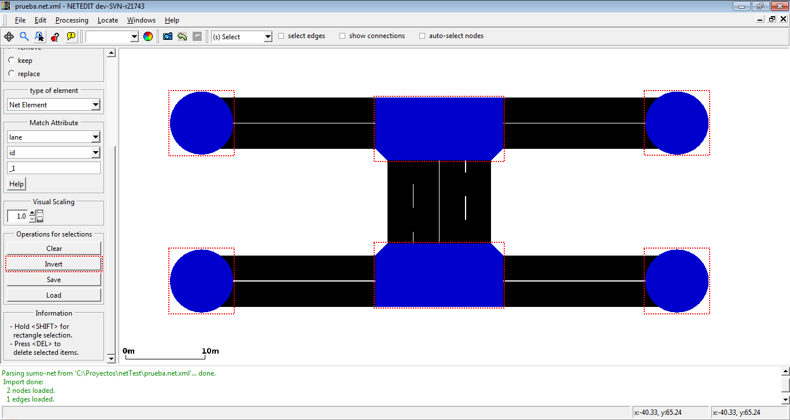Invert operation select all elements of the net and subtract the current selected elements

If we have a empty selection, we can select easy all elements of net . 

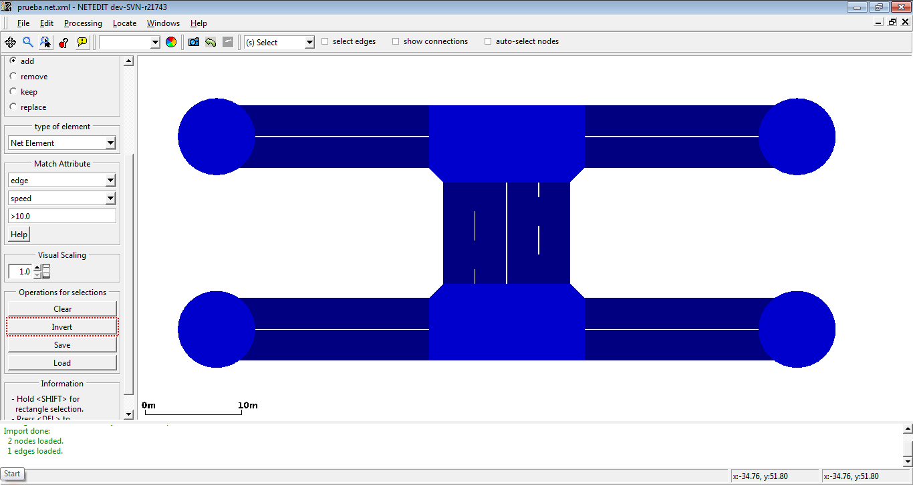With the invert button, we select all elements of net.

## Move

Move junctions by dragging with the left mouse button. Dragging edges creates or moves geometry points. Dragging a junction on top of another junction joins them into a single junction. By default, the junction shape is updated while moving. However the
final shape after saving or activating full recomputation (F5) may be slightly different.

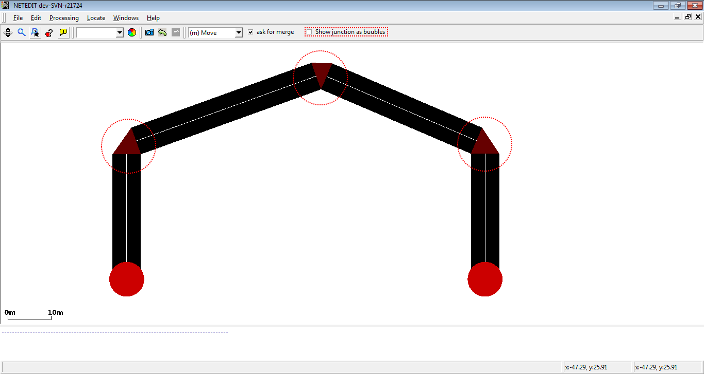By setting the option "show junctions as bubbles", circles are drawn instead of detailed junction shapes which can improve visibility.

### Changing Elevation ###
When checking the 'Elevation' checkbox, elevation of junctions and existing geometry points can be modified by dragging the with the mouse (with their x,y coordinates remaining unchanged).  At the same time, the numerical elevation value will be displayed for every junction and geometry point.  It is useful to combine this with [elevation or sloope coloring](../Networks/Elevation.md#visualizing_elevation_data).

### Moving Object Selections

- When selecting neighboring edges and dragging one of them, the neighboring edge will receive the same shape modifications
- When selecting an edge and its junctions and dragging any part of the selection, all parts including edge geometry will be moved in parallel
- When selecting an edge an one if its junctions:
  - When dragging the junction, only the junction will move
  - When dragging the edge, the edge will move locally and the junction will move in parallel

### Moving Polygons and TAZs

- When clicking over an Polygon/TAZ edge or vertex, contour will be moved
- If Polygon/TAZ is inspected an option "block shape" is enabled, then entire shape will be moved
  